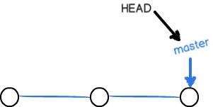
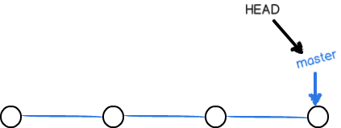

## 如何使用git ##

### 1 初始化一个git仓库 ###

通过 `git init` 命令把这个目录变成Git可以管理的仓库

	$ git init
	Initialized empty Git repository in /Users/michael/learngit/.git/

### 2 添加文件到git仓库 ###

第一步：`git add <file>`
用命令git add告诉Git，把文件添加到仓库

	$ git add readme.txt

第二步：`git commit`
用命令git commit告诉Git，把文件提交到仓库。-m后面输入的是本次提交的说明

	$ git commit -m "wrote a readme file"
	[master (root-commit) cb926e7] wrote a readme file
 	1 file changed, 2 insertions(+)
 	create mode 100644 readme.txt

### 3 运行git status命令看看结果

`git status`命令可以让我们时刻掌握仓库当前的状态

	$ git status
	# On branch master
	# Changes not staged for commit:
	#   (use "git add <file>..." to update what will be committed)
	#   (use "git checkout -- <file>..." to discard changes in working directory)
	#
	#    modified:   readme.txt
	#
	no changes added to commit (use "git add" and/or "git commit -a")

### 4 git diff查看difference

`git diff` 查看具体修改了什么内容

	$ git diff readme.txt 
	diff --git a/readme.txt b/readme.txt
	index 46d49bf..9247db6 100644
	--- a/readme.txt
	+++ b/readme.txt
	@@ -1,2 +1,2 @@
	-Git is a version control system.
	+Git is a distributed version control system.
	 Git is free software.

### 5 git log 查看commit 快照

`git log` 命令显示从最近到最远的提交日志。你看到的一大串类似3628164...882e1e0的是commit id（版本号）

	$ git log
	commit 3628164fb26d48395383f8f31179f24e0882e1e0
	Author: Michael Liao <askxuefeng@gmail.com>
	Date:   Tue Aug 20 15:11:49 2013 +0800
	
	    append GPL
	
	commit ea34578d5496d7dd233c827ed32a8cd576c5ee85
	Author: Michael Liao <askxuefeng@gmail.com>
	Date:   Tue Aug 20 14:53:12 2013 +0800
	
	    add distributed
	
	commit cb926e7ea50ad11b8f9e909c05226233bf755030
	Author: Michael Liao <askxuefeng@gmail.com>
	Date:   Mon Aug 19 17:51:55 2013 +0800
	
	    wrote a readme file

### 6 回退到上一个版本

`git reset`用`HEAD`表示当前版本，上一个版本就是`HEAD^`,上上一个版本就是`HEAD^^`,往上100个版本`HEAD~100`

	$ git reset --hard HEAD^
	HEAD is now at ea34578 add distributed

回退到指定版本。`git reset --hard [commit id]`

### 7 记录你的每一次命令

`git reflog`

	$ git reflog
	ea34578 HEAD@{0}: reset: moving to HEAD^
	3628164 HEAD@{1}: commit: append GPL
	ea34578 HEAD@{2}: commit: add distributed
	cb926e7 HEAD@{3}: commit (initial): wrote a readme file

### 8 工作区&暂存区

Git的版本库里存了很多东西，其中最重要的就是称为stage（或者叫index）的暂存区，还有Git为我们自动创建的第一个分支master，以及指向master的一个指针叫HEAD。

第一步是用`git add`把文件添加进去，实际上就是把文件修改添加到暂存区；

第二步是用`git commit`提交更改，实际上就是把暂存区的所有内容提交到当前分支。

### 9 `git checkout -- file` 丢弃工作区的修改

	$ git checkout -- readme.txt

* 命令git checkout -- readme.txt意思就是，把readme.txt文件在工作区的修改全部撤销，这里有两种情况：

* 一种是readme.txt自修改后还没有被放到暂存区，现在，撤销修改就回到和版本库一模一样的状态；

* 一种是readme.txt已经添加到暂存区后，又作了修改，现在，撤销修改就回到添加到暂存区后的状态。

* 总之，就是让这个文件回到最近一次git commit或git add时的状态。

### 10 删除文件

当你直接在文件管理器删除文件后，现在你有两个选择，

一是确实要从版本库中删除该文件，那就用命令`git rm`删掉，并且`git commit`：

	$ git rm test.txt
	rm 'test.txt'
	$ git commit -m "remove test.txt"
	[master d17efd8] remove test.txt
	 1 file changed, 1 deletion(-)
	 delete mode 100644 test.txt

另一种情况是删错了，因为版本库里还有呢，所以可以很轻松地把误删的文件恢复到最新版本：

	$ git checkout -- test.txt

### 11 关联一个远程库 

把一个已有的本地仓库与之关联，然后，把本地仓库的内容推送到GitHub仓库。

`git remote add origin git@server-name:path/repo-name.git`

	$ git remote add origin git@github.com:michaelliao/learngit.git

### 12 把本地库的所有内容推送到远程库上

添加后，远程库的名字就是origin，这是Git默认的叫法。把本地库的内容推送到远程，用git push命令，实际上是把当前分支master推送到远程

由于远程库是空的，我们第一次推送master分支时，加上了-u参数，Git不但会把本地的master分支内容推送的远程新的master分支，还会把本地的master分支和远程的master分支关联起来，在以后的推送或者拉取时就可以简化命令。

	$ git push -u origin master
	Counting objects: 19, done.
	Delta compression using up to 4 threads.
	Compressing objects: 100% (19/19), done.
	Writing objects: 100% (19/19), 13.73 KiB, done.
	Total 23 (delta 6), reused 0 (delta 0)
	To git@github.com:michaelliao/learngit.git
	 * [new branch]      master -> master
	Branch master set up to track remote branch master from origin.

从现在起，只要本地作了提交，就可以通过命令：

	$ git push origin master

### 13 远程克隆 `git clone`

用命令git clone克隆一个本地库

	$ git clone git@github.com:michaelliao/gitskills.git
	Cloning into 'gitskills'...
	remote: Counting objects: 3, done.
	remote: Total 3 (delta 0), reused 0 (delta 0)
	Receiving objects: 100% (3/3), done.

### 14 分支原理

一开始的时候，`master`分支是一条线，Git用`master`指向最新的提交，再用`HEAD`指向`master`，就能确定当前分支，以及当前分支的提交点

Git创建一个分支很快，因为除了增加一个`dev`指针，改改`HEAD`的指向，工作区的文件都没有任何变化

假如我们在`dev`上的工作完成了，就可以把`dev`合并到`master`上。直接把`master`指向`dev`的当前提交，就完成了合并：

合并完分支后，甚至可以删除dev分支。删除dev分支就是把dev指针给删掉，删掉后，我们就剩下了一条master分支：

### 15 分支操作

（1）、创建`dev`分支，然后切换到`dev`分支

	$ git checkout -b dev
	Switched to a new branch 'dev'

`git checkout`命令加上`-b`参数表示创建并切换，相当于以下两条命令：

	$ git branch dev
	$ git checkout dev
	Switched to branch 'dev'

（2）、用`git branch`命令查看当前分支：
	
	$ git branch
	* dev
	  master

（3）、`git add`在dev上修改,提交

	$ git add readme.txt 
	$ git commit -m "branch test"
	[dev fec145a] branch test
	 1 file changed, 1 insertion(+)

（4）、`git checkout master`切换回master分支

	$ git checkout master
	Switched to branch 'master'

（5）、用`git merge dev`把dev分支的工作成果合并到master分支上
	
	$ git merge dev
	Updating d17efd8..fec145a
	Fast-forward
	 readme.txt |    1 +
	 1 file changed, 1 insertion(+)